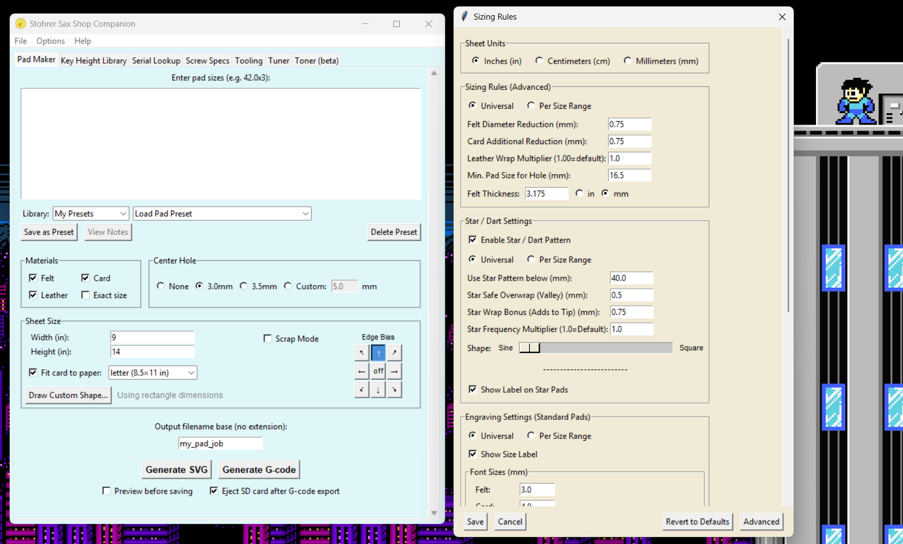
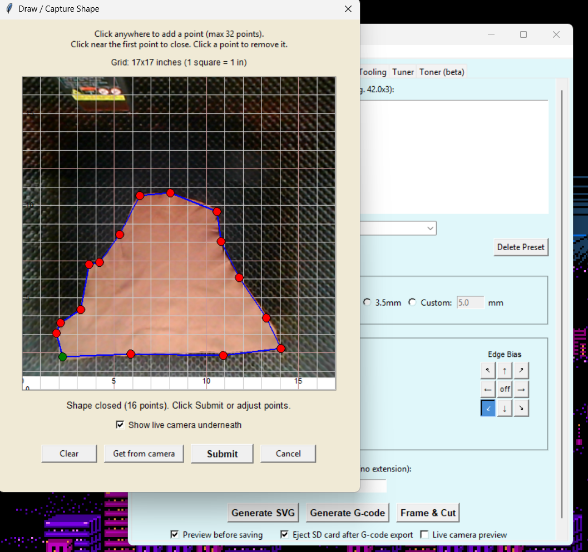
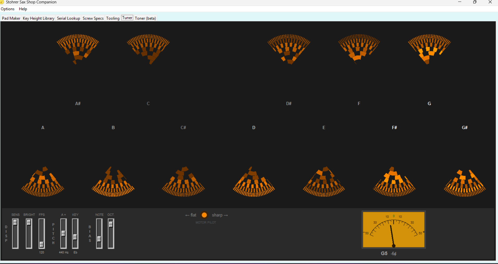

# Stohrer Sax Shop Companion

A cross-platform desktop app for saxophone repair shops and saxophonists by [Matt Stohrer](https://www.StohrerMusic.com). Generates SVG and G-code files for laser-cutting pad materials for the [Phil Noy](https://noysaxophonesupplies.com) padmaking method, provides reference databases for key heights, serial numbers, and screw specifications, includes tooling generation for Noy-style pad-making die inserts and holders, a 12 wheel chromatic strobe tuner, and a harmonic tone analyzer for studying your sound.

## Features

### Pad Maker



Generate laser-cutting files for felt, card, leather, and exact-size pad materials. **G-code generation can be exported directly to your laser — LightBurn is no longer required**, though SVG output is still available if you prefer that workflow.

#### Output Formats
- G-code for Grbl-based lasers with per-material speed, power, and passes
- SVG for LightBurn or other laser software (color layers map to operations)
- Generate felt, card, leather, and exact size patterns

#### Nesting & Layout
- Smart circle-packing algorithm to maximize material usage
- Edge bias d-pad to direct packing toward a specific edge or corner
  - Cardinal directions scan from the edge inward
  - Corner directions radiate outward — small pads nestle in the corner, larger ones fan out
- Nesting preview — see the layout before generating, adjust and retry
- Custom polygon shapes for irregular leather skins and scrap pieces (free vertex placement, grid auto-sized to your laser bed)
- Scrap mode — place pads across multiple pieces, tracking remaining between sheets
  - Preview, edge bias, and custom polygons all work together in scrap mode
  - **Large-batch optimization** (≥75 pads): opt-in multistart greedy that tries multiple disc orderings per scrap and keeps the best result. Typically fits 5–15% more pads on dense batches.
- Max fill mode — use `18.0 x max` to fill remaining space with a size

#### Sizing & Engraving
- Per-size-range settings for sizing rules, dart/star cuts, engraving, and placement
- Pad size labels on each disc, with per-material font size and position
- Line mode (single-stroke) or filled mode (scan-line raster fill with overscan)
- Auto-fit — shifts text toward center on small pads, scales only as last resort
- **Sizing Rules Presets** — save the entire Sizing Rules dialog as a named preset, load presets from a dropdown, import/export to share with other techs

#### G-code Options
- Air assist toggles (M8/M9) per layer
- Cut grouping: by layer or by pad
- Kerf compensation (enter full kerf, app splits in half automatically)
- Auto-eject SD card after export (Windows)

#### Pad Presets & Data
- Save and load pad size lists organized into libraries
- Notes field for annotating presets
- Import Matt's Pad Sets from [stohrermusic.com](https://www.stohrermusic.com/articles/pad-sets-library/)
- Import/export for sharing with colleagues

#### Machine Integration (experimental, opt-in)



Direct USB serial control of a Grbl-compatible laser (Creality Falcon2 Pro 40W tested; other Grbl machines should work — opt in via **File > Feature Set > "Experimental: machine integration"**).

- **Camera Calibration** — one-time ChArUco-card workflow. Engrave the card on basswood, capture 12 frames; the app then knows where the camera sees vs. where the laser cuts.
- **Get from Camera** in the polygon-draw dialog — auto-detect a scrap outline and use it as your custom shape.
- **Live camera overlay** in the polygon-draw dialog — trace your scrap by eye on top of the live camera image at 1:1 scale.
- **Frame & Cut** — a third button next to Generate SVG / Generate G-code. Generates the G-code in memory, positions the head (Home Laser, jog buttons, optional "Try Auto Locate"), low-power framing pass for verification, then streams the cut. Pause / Resume / Stop in real time.
- **Inset Margin** — adds a safety margin to placement on scraps so you don't accidentally clip an edge. Frame still traces the actual scrap outline; cuts respect the safety boundary.
- **Machine menu** (Options > Machine): Home Laser, Test Connection, Clear Errors, Reset Falcon, Camera Calibration, Camera-Polygon Inset Margin.

### Key Height Library
- Store and organize key height measurements by instrument
- Import Matt's Key Heights from [stohrermusic.com](https://www.stohrermusic.com/articles/key-heights-library/)
- Import/export libraries for backup or sharing

### Serial Number Lookup
- Reference database for saxophone serial numbers by manufacturer

### Screw Specifications
- OEM screw and rod specifications database
- Import Matt's Specs from [stohrermusic.com](https://www.stohrermusic.com/articles/screw-specs-library/)
- Import/export for sharing specs

### Tooling
- **Die Inserts** — laser-cut acrylic dies (small: 50mm OD, large: 70mm OD). Enter individual sizes, ranges, or generate full sets. Scrap mode for spreading dies across multiple sheets.
- **Die Holders** — 85mm OD stack. Pick 5-layer (solid + magnet + 2× pin + ring) or 6-layer (solid + magnet + 3× pin + ring), and variant Large / Small / Both (Both nests two complete independent holders onto a single sheet). User-defined sheet size with a clear minimum-size error if pieces don't fit.
- **Die Organizer** — SVG templates for a stackable die organizer (230 × 330 mm). Cut three Uppers and one Lower, align the four 1/8″ corner holes, glue the stack together.
- **Pad Press Spacers** — bundled 3D-printable STL files for setting pad press depth. Half-step set (3.0 / 3.5 / 4.0 / 4.5 mm), quarter-step set (3.25 / 3.75 / 4.25 mm), and an organizer rack.
- **Kerf Test** — quick three-circle pattern for measuring kerf on any material.
- **Speed & Power Test (beta)** — generate a sheet of small test discs at different speed / power / passes combinations to dial in laser settings on a new material. Each disc engraved with a 2-digit ID; a `legend.txt` saved alongside the G-code maps each ID to its parameters. Sweep 0–3 variables; "Also test with air off" doubles the matrix for side-by-side air-quality comparison.
- **G-code presets** — Options > Tooling Settings now exposes per-material G-code (Acrylic + Basswood). The basswood preset feeds both the die organizer (when you cut it in LightBurn) and the camera-calibration card engrave. Defaults tuned for the Falcon2 Pro 40W; adjust to your machine.

### Chromatic Strobe Tuner



- 12-wheel stroboscopic chromatic tuner
- GPU-accelerated rendering via Rust/wgpu — 60-120 fps strobe wheels
  - Automatic fallback to CPU canvas rendering if GPU unavailable
- Per-ring octave brightness from real spectral data
- Grouped slider panel (display, pitch, bias) and vintage backlit VU meter
- Per-pitch-class phase tracking with temporal smoothing
- Transposition support (Concert, Bb, Eb, F)
- Configurable frame rate (60/90/120 fps), backlight color, and faceplate color
- A quality microphone is recommended (e.g. Audio-Technica AT2020 USB)

### Harmonic Tone Analyzer (beta)

A real-time harmonic spectrum analyzer for saxophone. Captures the fundamental and overtones of your sound and lets you compare setups (horn, mouthpiece, reed, mic, mic placement, embouchure) over time. **A quality microphone is essential — laptop mics do not provide reliable results.**

#### Live Display
- Detects fundamental pitch, extracts up to 20 harmonics
- Spectrum view (full FFT) and Bars view (per-harmonic), linear or dB scale
- Intonation gauge with cents readout and ±4¢ "in tune" lamp
- Auto-transposition by saxophone type (alto/tenor/soprano/baritone/etc.) with concert pitch toggle
- Spectrum overlay: load any preset as a ghost overlay on the live spectrum

#### Tone Presets
- Capture harmonic fingerprints of individual horns and setups
- Free capture (continuous micro-captures while playing naturally) and guided calibration modes
- WAV file import for offline analysis (16/24/32-bit)
- WAV recording **on by default** — captures are automatically re-analyzed offline for ~2× the harmonic resolution of live capture
- Mic type, model, and position stored per preset for reproducibility
- **Mutate Preset** — duplicate a preset with one variable changed (mouthpiece, mic, reed) for A/B testing
- **Sandbox mode** — relaxes field requirements for non-sax instruments, contact mics, effects chains, or experimental setups
- All captures stored in concert pitch for cross-instrument comparison
- Organized into libraries, with import/export for sharing
- Coverage summary after capture sessions — note distribution chart and gap detection

#### Analyze Tool
- Compare two presets, view a single preset in detail, or analyze multi-preset spreads
- Difference charts and harmonic-range interpretation: H1-H4 shifts ≈ bore, H7-H13 ≈ neck/mouthpiece, broadband ≈ mouthpiece/player
- Population percentiles — see where your captures rank within all presets of the same sax type
- User-configurable comparison descriptors: harmonic complexity, warmth, even/odd harmonic ratio, rolloff shape, evenness
- Filter by make, model, mic type, search; multi-select; same-player and cross-player context notes
- Recording-quality tracking (harmonic rolloff rate) with live warnings and cross-mismatch detection

#### Why beta?
Descriptors are still being calibrated as we gather more data from different horns, mouthpieces, mics, and players. Live descriptor gauges have been removed for now because mic position alone shifts complexity 10–20% on the same horn — we want to ground the formulas in more recordings before promoting any back to live readouts. Raw harmonic measurements are always saved, so future formula improvements apply retroactively to your historical captures. The first-run dialog (File > Feature Set > Toner) explains how to contribute recordings and presets.

### General
- Feature Set (File > Feature Set) — choose which tabs to show
- Tab-aware User Guide (Help > User Guide)
- Runs on Windows, macOS, and Linux
- macOS dark mode support
- Platform-appropriate config storage with automatic migration
- Import Settings from Folder for moving between machines
- Error logging with Help > Open Log File for diagnostics

## Installation

### From Release (Recommended)
Download the latest release for your platform from the [Releases](https://github.com/stohrermusic/Stohrer-Sax-Shop-Companion/releases) page.

**macOS users**: Two builds are available — **Apple Silicon** (M1/M2/M3/M4) with full features, and **Intel** with all features except the Tuner and Tone Analyzer (which require audio libraries not available on Intel Macs).

The app is not signed with an Apple Developer certificate, so macOS will block it on first launch with either an "unidentified developer" warning or a "damaged and can't be opened" error. To unblock it:

1. Double-click the downloaded `.zip` to unzip it.
2. Drag `SaxShopCompanion.app` into your **Applications** folder.
3. Open **Terminal** (in `/Applications/Utilities/`) and paste this one command:
   ```
   xattr -cr /Applications/SaxShopCompanion.app
   ```
4. Open the app normally. You only need to do this once.

This strips the quarantine flag that macOS adds to downloaded files, which is what triggers both warnings. The same command works on every macOS version.

**Linux users**: The tuner and toner require PortAudio. Install it with:
```
sudo apt install libportaudio2
```
The app works without it, but the audio tabs will be unavailable.

### From Source
```bash
pip install -r requirements.txt
python main.py
```

## Building

```bash
# Build for current platform
python build.py

# Clean and rebuild
python build.py --clean

# macOS: create .dmg
python build.py --dmg
```

## Config Location

Settings and presets are stored in platform-appropriate locations:
- **Windows**: `%APPDATA%\StohrerSaxShopCompanion\`
- **macOS**: `~/Library/Application Support/StohrerSaxShopCompanion/`
- **Linux**: `~/.config/StohrerSaxShopCompanion/`

## Questions or Feedback

Email: stohrermusic@gmail.com

---

Made for saxophone repair shops and saxophonists, by a saxophone tech.
